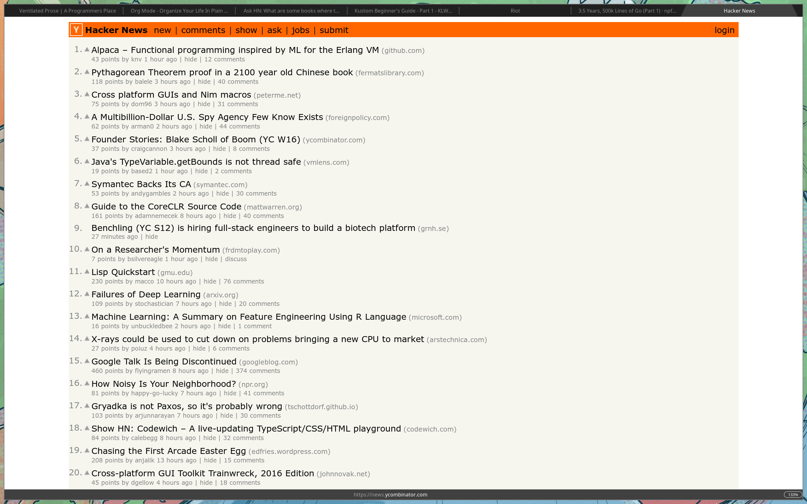
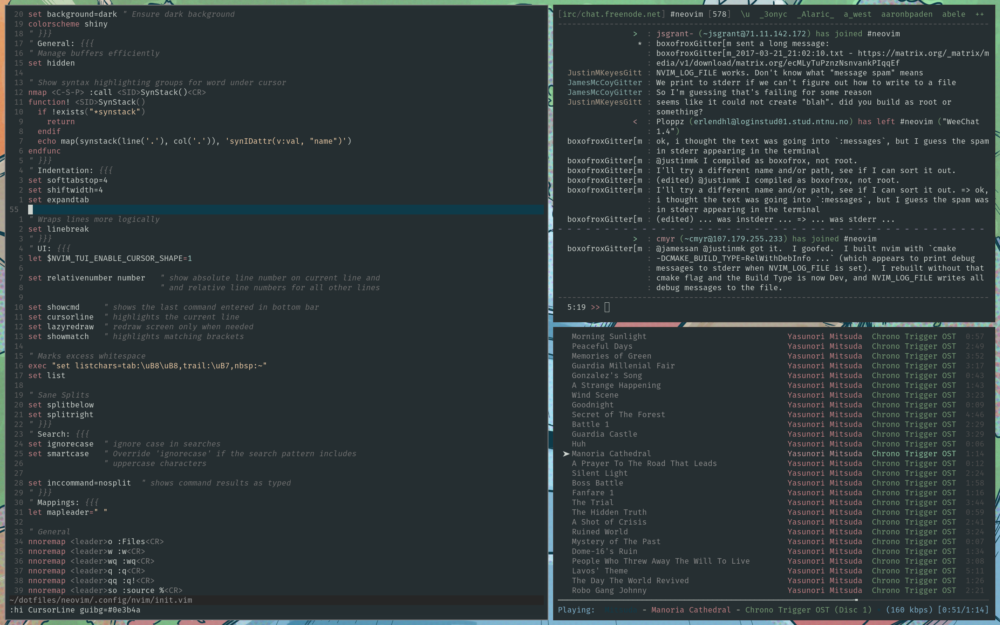

# dotfiles

[bite my shiny metal ass](https://streamable.com/a2skd)

Fake pretty design

Running the [Rofi](https://davedavenport.github.io/rofi/) launcher

Custom dropdown terminal

Firefox as one of the only GTK (or QT) apps used

Everyday work
